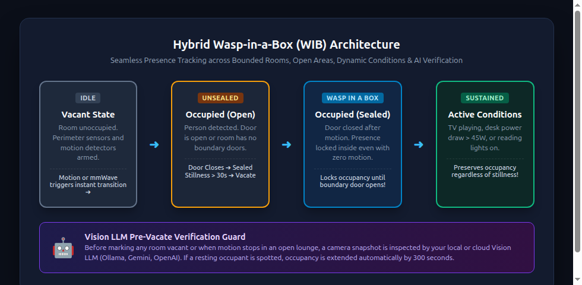
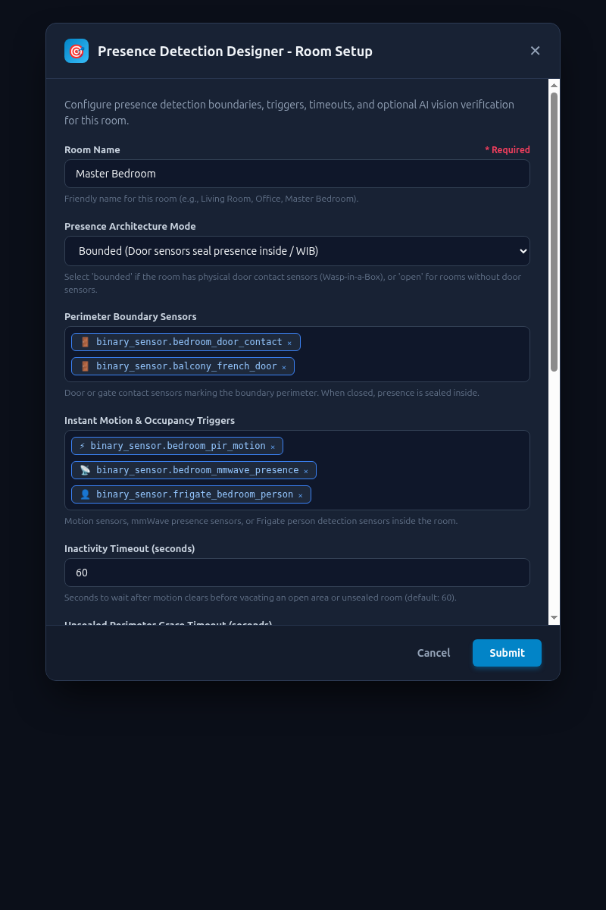
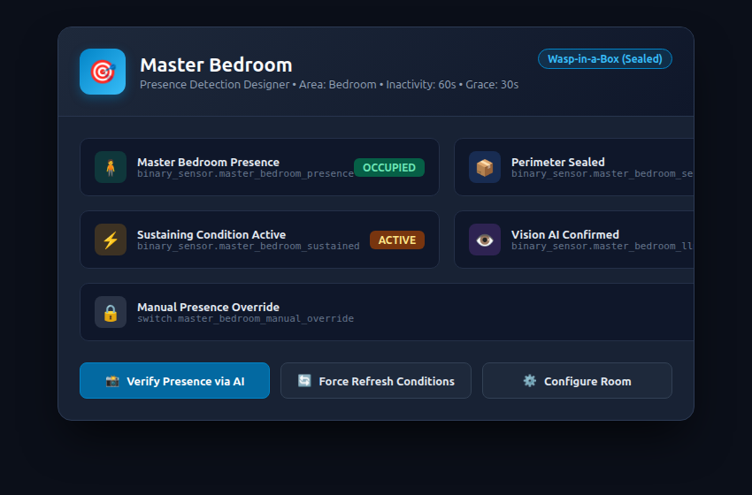

<div align="center">


# Presence Detection Designer (`ha-presence-detection-designer`)

**Intelligent Home Assistant Presence State Machine with Hybrid Wasp-in-a-Box (WIB), Dynamic Sustaining Conditions & AI Vision Verification.**

[](https://github.com/spelech/ha-presence-detection-designer/actions/workflows/ci.yml)
[](https://hacs.xyz/)
[](https://www.python.org/)
[](https://opensource.org/licenses/MIT)
[](https://github.com/spelech/ha-presence-detection-designer)

</div>

---

## 🌟 Why Presence Detection Designer?

Passive infrared (PIR) motion sensors and Frigate person bounding boxes work well when occupants walk around, but fail during ordinary life:
- **Stationary Occupancy Failure**: Watching a movie on the couch, reading a book in bed, or working at a desk? Motion clears and your room lights suddenly shut off.
- **The "Wild Guess" Timer Trap**: Setting a 45-minute inactivity timer keeps lights on long after everyone has left the room.
- **Open vs Bounded Rooms**: Traditional Wasp-in-a-Box setups assume every room has closed perimeter doors. In modern open-concept floorplans (kitchens, dining areas, lofts), doors simply do not exist.

**Presence Detection Designer** eliminates false-clears by combining **three coordinated layers**:
1. **Hybrid Wasp-in-a-Box (WIB)**: Distinguishes between enclosed rooms (with door sensors) and doorless open layouts.
2. **Dynamic Sustaining Conditions**: Preserves occupancy while secondary devices indicate presence (e.g., Apple TV playing, PC workstation power draw > 45W).
3. **AI / Vision LLM Pre-Vacate Guard**: Before turning off lights or marking a room vacant, captures a snapshot from your security camera or video stream and asks a local (Ollama / vLLM) or cloud (OpenAI / Gemini) Vision model to confirm if an occupant is still in the room.

---

## 🏛️ Architecture Overview

<div align="center">
  
</div>

### State Machine Lifecycle
- **`idle_clear` (Vacant)**: Perimeter armed. Awaiting PIR, mmWave, or Frigate trigger.
- **`occupied_unsealed` (Open / Unsealed)**: Immediate activation upon motion. If door boundary is open or the room is an open-concept area, inactivity countdown starts when motion clears.
- **`occupied_sealed` (Wasp-in-a-Box Sealed)**: For bounded rooms with door contact sensors. Once motion occurs and door closes, occupancy is sealed inside indefinitely regardless of motion stillness.
- **`occupied_sustained`**: Active sustaining conditions (TV playing, power draw above threshold) hold presence locked.
- **`llm_verifying`**: Prior to vacating, camera snapshot is evaluated by AI. If a person is resting in the frame, occupancy extends by a configurable interval (default: 300s).
- **`override`**: Dedicated toggle switch forces presence indefinitely for house parties or guests.

---

## 📸 Screenshots & UI Experience

### 1. Intuitive Native Configuration Flow
Every field features clear labels and detailed hint descriptions (`data_description`) guiding you through setup:

<div align="center">
  
</div>

### 2. Comprehensive Device Card & Controls
Each configured room exposes primary occupancy, perimeter sealed status, sustaining condition state, AI verification indicator, and manual override switches:

<div align="center">
  
</div>

---

## 🚀 Setup Walkthrough (Step-by-Step)

### Step 1: Installation via HACS
1. Open **HACS** in your Home Assistant dashboard.
2. Click the three dots (top right) > **Custom repositories**.
3. Repository URL: `https://github.com/spelech/ha-presence-detection-designer`
4. Category: **Integration**
5. Click **Add**, find **Presence Detection Designer**, and click **Download**.
6. **Restart Home Assistant**.

*(Alternatively, copy `custom_components/presence_detection_designer/` into your `<config>/custom_components/` directory).*

---

### Step 2: Configure a Room

Navigate to **Settings** > **Devices & Services** > **Add Integration** and search for **Presence Detection Designer**.

#### Scenario A: Bounded Room (e.g. Master Bedroom, Bathroom, Office)
1. **Room Name**: `Master Bedroom`
2. **Presence Architecture Mode**: Select `bounded`.
3. **Perimeter Boundary Sensors**: Select your door sensors (`binary_sensor.bedroom_door_contact`).
4. **Instant Motion & Occupancy Triggers**: Select your motion detectors (`binary_sensor.bedroom_pir`, `binary_sensor.bedroom_mmwave`).
5. **Inactivity Timeout**: `60` seconds (countdown used if door remains ajar).
6. **Unsealed Grace Timeout**: `30` seconds.

> [!TIP]
> Once motion is detected and the door is closed, Presence Detection Designer seals the room. You can sleep or read completely still without lights switching off!

#### Scenario B: Open Area (e.g. Living Room, Kitchen)
1. **Room Name**: `Living Room`
2. **Presence Architecture Mode**: Select `open`.
3. **Boundary Sensors**: Leave empty.
4. **Instant Triggers**: Select your living room motion sensors or Frigate person detection.
5. **Inactivity Timeout**: `120` seconds.

---

### Step 3: Configure AI Vision Snapshot Verification (Optional)

Never get left in the dark when watching a movie or relaxing on the couch:

1. In the room setup or options modal, toggle **Enable AI / Vision Snapshot Verification**.
2. **Camera Entity**: Select your living room camera (`camera.living_room_substream`) or specify a direct snapshot URL (`http://frigate:5000/api/living_room/latest.jpg`).
3. **Vision API Endpoint URL**:
   - **Local Ollama**: `http://192.168.1.100:11434/v1/chat/completions` (Model: `llama3.2-vision:latest` or `llava`)
   - **OpenAI**: `https://api.openai.com/v1/chat/completions` (Model: `gpt-4o-mini`)
   - **Local vLLM / LocalAI**: `http://vllm.lan:8000/v1/chat/completions`
4. **Vision API Key**: Enter your API key (leave blank for local Ollama).
5. **Occupancy Extension Timeout**: `300` seconds (adds 5 minutes when a person is visually spotted).

---

## 📦 Entities Created per Room

| Entity | Domain | Purpose |
| :--- | :--- | :--- |
| `binary_sensor.<room>_presence` | `binary_sensor` (`occupancy`) | Primary room presence output for automations. |
| `binary_sensor.<room>_perimeter_sealed` | `binary_sensor` (`lock`) | Indicates if the Wasp-in-a-Box boundary is sealed. |
| `binary_sensor.<room>_sustaining_condition` | `binary_sensor` | Indicates if an active media player or power draw is holding presence. |
| `binary_sensor.<room>_llm_verified` | `binary_sensor` | Confirmed human occupant detected by Vision AI. |
| `switch.<room>_manual_override` | `switch` | Locks presence ON indefinitely (parties, guests, cleaning). |
| `button.<room>_verify_presence` | `button` | Triggers an immediate snapshot capture and AI verification check. |
| `button.<room>_force_refresh` | `button` | Re-evaluates all sustaining conditions immediately. |

---

## 🛎️ Services / Actions

### `presence_detection_designer.verify_presence`
Manually trigger an immediate camera snapshot and AI vision analysis:
```yaml
action: presence_detection_designer.verify_presence
data:
  entry_id: "your_config_entry_id"  # Optional: omit to verify all rooms
```

### `presence_detection_designer.force_refresh`
Forces an immediate re-evaluation of all sustaining conditions (e.g. after TV power toggle):
```yaml
action: presence_detection_designer.force_refresh
```

---

## 🧪 Development & Quality Gates

This repository strictly enforces 5-stage automated CI quality gates:
- **Repository Integrity**: Release consistency, manifests, and file layout validation.
- **HACS Action**: Full compliance with HACS standards.
- **Hassfest**: Strict Home Assistant manifest, strings, and translation schema validation.
- **Ruff**: Modern Python linting and code formatting checks.
- **Pytest**: Comprehensive test suite enforcing **>= 80% code coverage** (including state machine simulations).

```bash
# Run Ruff lint and format check
uv run ruff check .
uv run ruff format --check .

# Run pytest with coverage enforcement
uv run pytest --cov=custom_components/presence_detection_designer --cov-fail-under=80 -v
```

---

## 📄 License

Distributed under the [MIT License](LICENSE). Copyright &copy; 2026 Steven T. Pelech.
